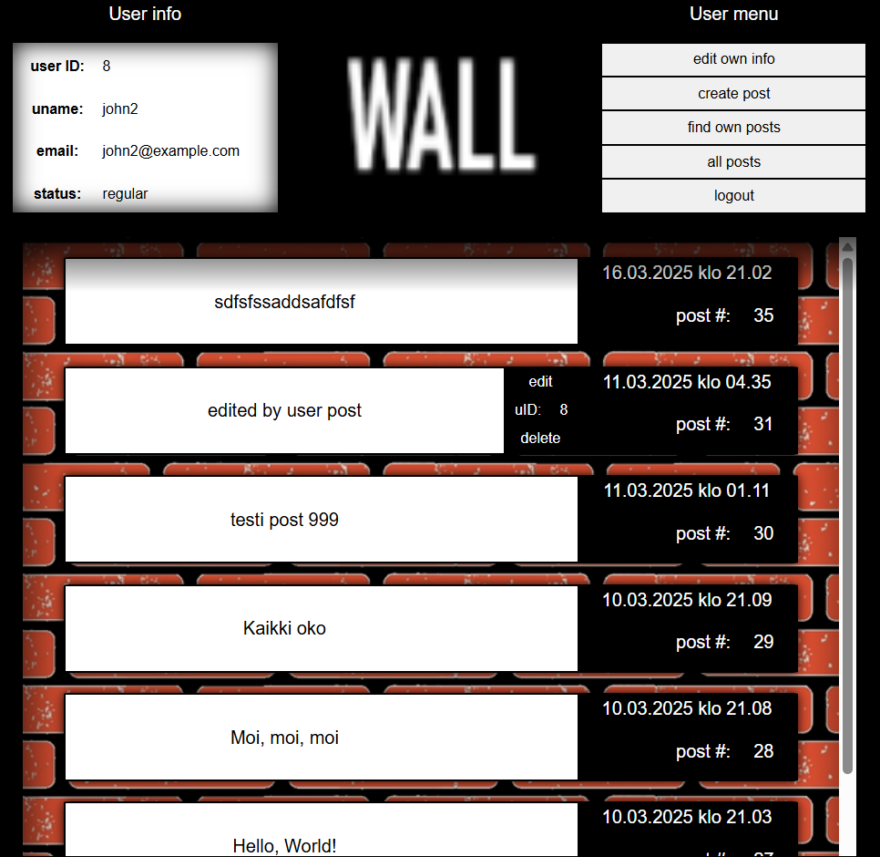
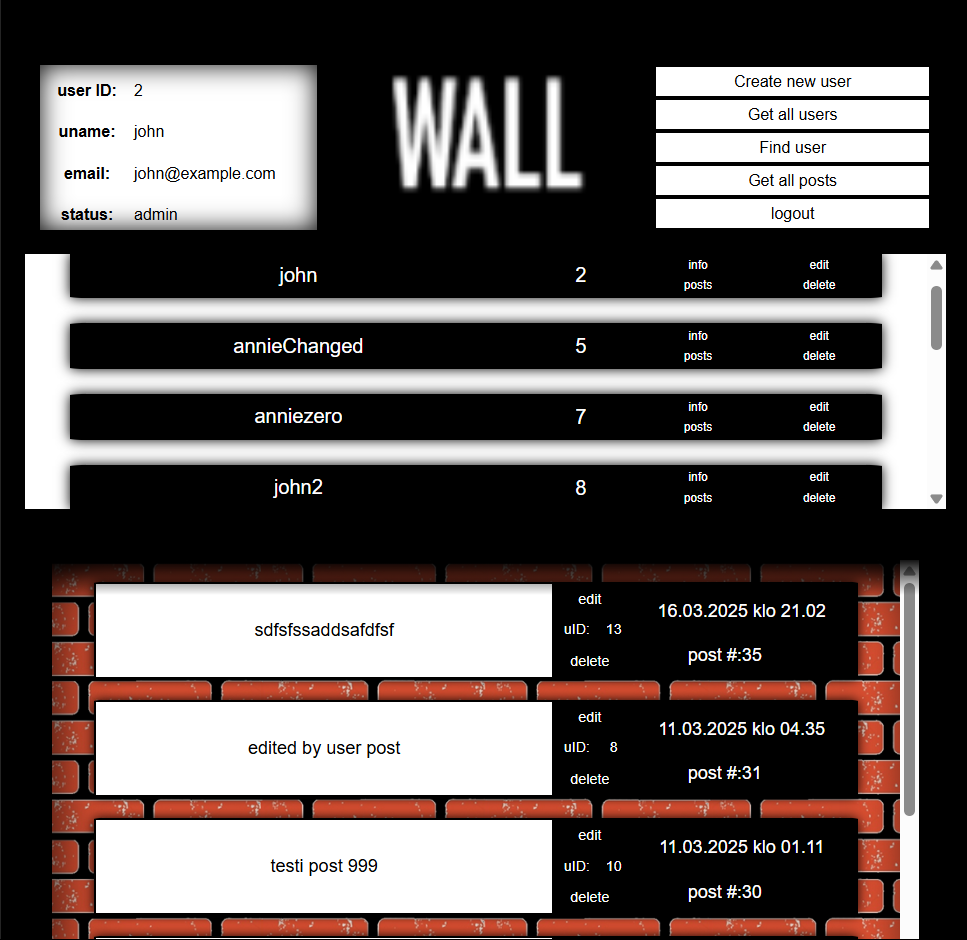

# Wall

## Screenshots

## Application Access  
🔹 **Frontend:** [my-app-frontend](https://github.com/source-bob/testProjekti/tree/final2/FE/testiSivu)  
🔹 **Backend:** [my-app-backend](https://github.com/source-bob/testProjekti/tree/final2/BE)

## Running the Project Locally 
### **1. Clone the repository:**  

- git clone https://github.com/source-bob/testProjekti.git
- cd testProjekti

### **2. Install dependencies:**
**Backend:**
- cd BE
- npm install

**Frontend:**
- cd ../FE/testiSivu
- npm install

### **3. Start the server and client:**
**Backend:**
- npm run dev

**Frontend:**
- npm run dev

## API Documentation
**Test API requests file:**  
[test-requests.http](BE/test/test-requests.http) 

**Base API URL (local):**  
`http://localhost:3000/api`

### Auth
- POST    /api/auth/register  - register a new user
- POST    /api/auth/login     - log in and receive a token
- GET     /api/auth/me        - verify token

### Post
- GET     /api/posts          - get all posts
- POST    /api/posts          - create a new post
- GET     /api/posts/:id      - get posts by user ID
- PUT     /api/posts/:id      - edit a post by ID
- DELETE  /api/posts/:id      - delete a post by ID

### User
- GET     /api/users          - get all users
- POST    /api/users          - create a user
- GET     /api/users/:id      - get a user
- PUT     /api/users/:id      - update a user
- DELETE  /api/users/:id      - delete a user by ID

## Database Structure
**SQL script for database creation:**  
[db-script.sql](BE/db/db-script.sql)

- users (user_id PK, username, password, email, user_level,  registered_at)  
- posts (entry_id PK, user_id FK, note, created_at) 

## Implemented Features
- User registration and authentication
- Creating, editing, and deleting posts
- All API requests require JWT authentication (except registration and login)

## Known Issues
- Page information sometimes does not update (but the database updates correctly)
- Logo supports only one size. Adaptive image support is needed.
- Some error messages do not appear for the admin. Possible issue with exception handling.

## Technologies Used 
- [React](https://react.dev) + [Vite](https://vite.dev)
- [Express.js](https://expressjs.com) + [MySQL](https://www.mysql.com)  
- [JWT](https://jwt.io) for authentication

 

